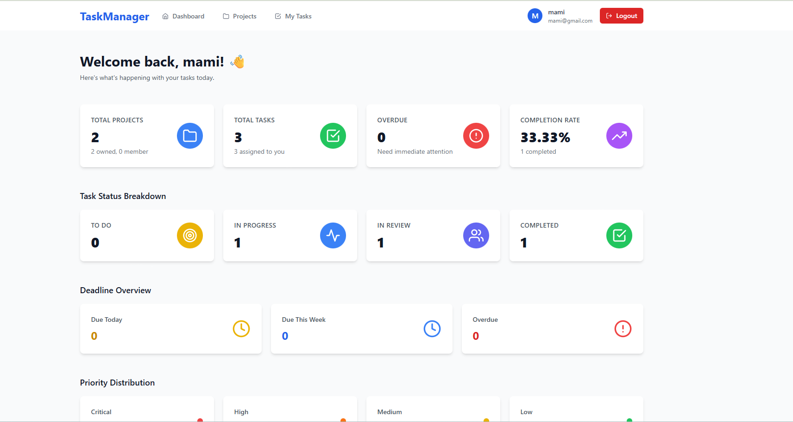
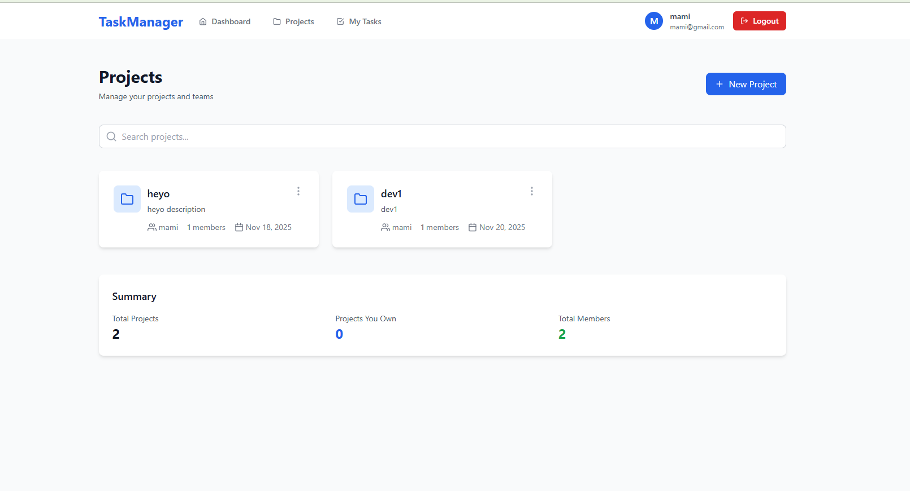
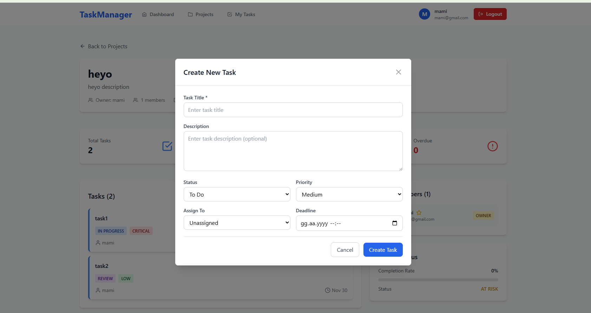
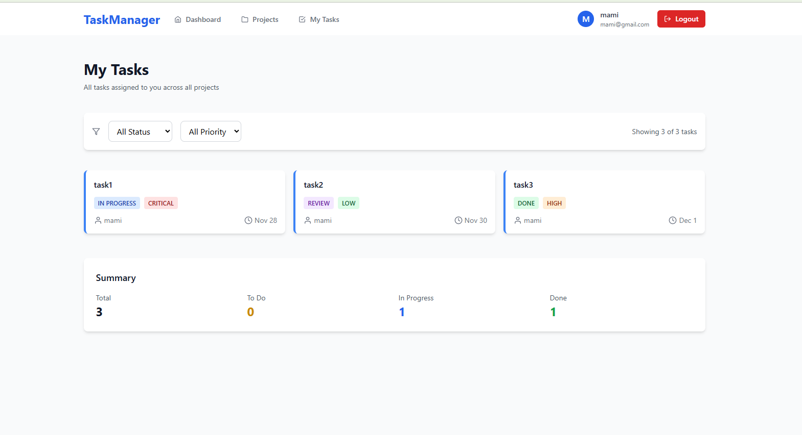
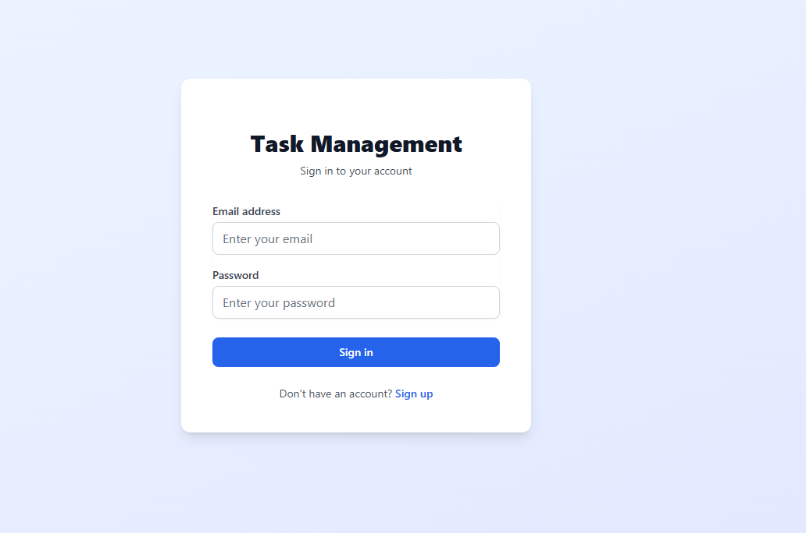

# 📋 Task Management System

Full-stack task management application with Spring Boot and React. JWT authentication, real-time statistics, and team collaboration features.


## 📸 Screenshots

<details>
<summary>Click to view screenshots</summary>

### Dashboard


### Projects & Tasks




### Authentication


</details>

## ✨ Features

- 🔐 **JWT Authentication** - Secure login with role-based access
- 📊 **Project Management** - Create projects, invite team members
- ✅ **Task Tracking** - Create, assign, filter tasks with priorities
- 📈 **Real-time Dashboard** - Statistics, completion rates, deadline alerts
- 🔍 **Advanced Search** - Filter by status, priority, assignee with pagination
- 📱 **Responsive UI** - Modern design with Tailwind CSS

## 🛠️ Tech Stack

**Backend:** Spring Boot 3.5.7 • Spring Security • JWT • PostgreSQL • JPA/Hibernate  
**Frontend:** React 18 • React Router • Tailwind CSS • Axios • Vite

## 🚀 Quick Start

### Prerequisites
- Java 21+
- Node.js 18+
- PostgreSQL 14+

### Setup

**1. Clone & Database**
```bash
git clone https://github.com/MFO34/task-management.git
cd task-management

# Create PostgreSQL database
createdb taskmanagement
```

**2. Backend**
```bash
cd task-management-backend

# Update application.properties with your DB credentials
# spring.datasource.username=YOUR_USERNAME
# spring.datasource.password=YOUR_PASSWORD

mvn spring-boot:run
# Runs on http://localhost:8080
```

**3. Frontend**
```bash
cd task-management-frontend
npm install
npm run dev
# Runs on http://localhost:5173
```

**4. Login**
- Register a new account or use demo credentials
- Start creating projects and tasks!

## 📚 API Endpoints

| Endpoint | Method | Description |
|----------|--------|-------------|
| `/auth/register` | POST | Register new user |
| `/auth/login` | POST | Login and get JWT token |
| `/api/projects` | GET, POST | Manage projects |
| `/api/projects/{id}/tasks` | GET, POST | Manage tasks |
| `/api/tasks/my-tasks` | GET | Get user's tasks |
| `/api/tasks/search` | GET | Advanced task search |
| `/api/stats/dashboard` | GET | Dashboard statistics |

**Authentication:** Add JWT token to `Authorization: Bearer <token>` header

## 🏗️ Project Structure
```
task-management/
├── task-management-backend/    # Spring Boot API
│   ├── config/                 # Security, CORS
│   ├── controller/             # REST endpoints
│   ├── entity/                 # JPA entities
│   ├── service/                # Business logic
│   └── security/               # JWT utilities
│
└── task-management-frontend/   # React SPA
    ├── components/             # UI components
    ├── pages/                  # Route pages
    ├── services/               # API calls
    └── context/                # Auth state
```

## 🔐 Security

- JWT token-based authentication
- BCrypt password hashing
- Role-based authorization (USER/ADMIN)
- CORS configuration for frontend
- Input validation with Jakarta Validation

## 🎯 Key Features Explained

**Projects**
- Create unlimited projects
- Add/remove team members
- Owner and member roles
- Project statistics

**Tasks**
- Status: TODO → IN_PROGRESS → REVIEW → DONE
- Priority: LOW, MEDIUM, HIGH, CRITICAL
- Assign to team members
- Set deadlines with overdue detection
- Full-text search and filtering
- Pagination for large lists

**Dashboard**
- Real-time project and task metrics
- Completion rates
- Overdue task alerts
- Status and priority breakdowns

## 🚀 Future Enhancements

- [ ] Task comments and file attachments
- [ ] Email notifications
- [ ] Calendar view
- [ ] Time tracking
- [ ] Dark mode
- [ ] Mobile app

## 🤝 Contributing

1. Fork the repository
2. Create feature branch (`git checkout -b feature/AmazingFeature`)
3. Commit changes (`git commit -m 'Add AmazingFeature'`)
4. Push to branch (`git push origin feature/AmazingFeature`)
5. Open Pull Request

## 📝 License

MIT License - see [LICENSE](LICENSE) file

## 👨‍💻 Author

**MFO34**  
GitHub: [@MFO34](https://github.com/MFO34)

---

⭐ **Star this repo if you find it helpful!**